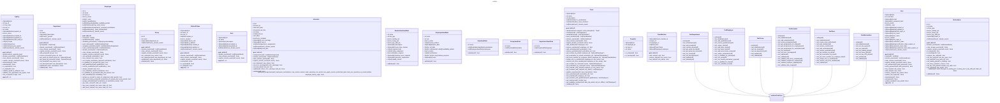

```mermaid
---
title: entities
---
classDiagram
    class ApiKey {
        + Optional[int] id
        + str key_id
        + str key_value
        + int user_id
        + str name
        + Optional[datetime] expires_at
        + bool is_active
        + Optional[datetime] created_at
        + Optional[datetime] updated_at
        + Optional[datetime] last_used_at
        + List[str] scopes
        + List[str] allowed_ips
        + List[str] allowed_user_agents
        - List[DomainEvent] _domain_events
        - __post_init__(self)
        - @staticmethod _generate_key()
        + domain_events(self) List[DomainEvent]
        + clear_domain_events(self) None
        + register_domain_event(self, event) None
        + deactivate(self) None
        + activate(self) None
        + is_expired(self) bool
        + is_valid(self) bool
        + validate_ip(self, ip_address) bool
        + validate_user_agent(self, user_agent) bool
        + has_scope(self, scope) bool
        - __repr__(self) str
    }

    class Department {
        + int id
        + str name
        + Optional[str] description
        - List['Group'] _groups
        - List[DomainEvent] _domain_events
        - __post_init__(self)
        + groups(self) List['Group']
        + domain_events(self) List[DomainEvent]
        + clear_domain_events(self) None
        + register_domain_event(self, event) None
        + add_group(self, group) bool
        + remove_group(self, group_id) bool
        + get_group_by_id(self, group_id) Optional['Group']
        + get_group_by_name(self, name) Optional['Group']
        + set_name(self, new_name) bool
        + set_description(self, new_description) bool
        + update(self, name, description) None
        + validate(self) None
    }

    class Employee {
        + int id
        + str name
        + int team_id
        + bool is_active
        - List[str] _roles
        - List[str] _qualifications
        - List[EmployeeAvailability] _available_periods
        - List[WorkHistoryEntry] _work_history
        - List[WorkstationAssignment] _assigned_workstations
        - List[TeamMember] _team_memberships
        - List[DomainEvent] _domain_events
        - __post_init__(self)
        + roles(self) List[str]
        + qualifications(self) List[str]
        + available_periods(self) List[EmployeeAvailability]
        + work_history(self) List[WorkHistoryEntry]
        + assigned_workstations(self) List[WorkstationAssignment]
        + team_memberships(self) List[TeamMember]
        + domain_events(self) List[DomainEvent]
        + clear_domain_events(self) None
        + register_domain_event(self, event) None
        + can_work(self, workstation) bool
        + has_role(self, role_name) bool
        + can_handle_workstation_type(self, workstation) bool
        + is_qualified_for_line(self, line_type) bool
        + add_qualification(self, qualification) bool
        + remove_qualification(self, qualification) bool
        + assign_role(self, role) bool
        + can_substitute_for(self, workstation) bool
        + is_available_for_period(self, date_obj, period) bool
        + add_availability(self, availability) bool
        + assign_as_aro(self, to_team_id, assignment_date, period) bool
        + add_work_history_entry(self, workstation_id, worked_date, work_period) bool
        + assign_workstation(self, workstation_id, workstation_name) bool
        + get_team_roles(self, team_id) List[str]
        + has_team_role(self, role_name, team_id) bool
        + add_team_role(self, role_name, team_id) bool
    }

    class Group {
        + int id
        + str name
        + Optional[int] department_id
        - List[DomainEvent] _domain_events
        - __post_init__(self)
        + domain_events(self) List[DomainEvent]
        + clear_domain_events(self) None
        + register_domain_event(self, event) None
        + set_name(self, new_name) bool
        + set_department(self, new_department_id) bool
        + update(self, name, department_id) None
        + validate(self) None
    }

    class RefreshToken {
        + Optional[int] id
        + str token_id
        + int user_id
        + datetime expires_at
        + bool is_revoked
        + Optional[str] device_info
        + Optional[str] ip_address
        + Optional[datetime] created_at
        + Optional[datetime] updated_at
        - List[DomainEvent] _domain_events
        - __post_init__(self)
        + domain_events(self) List[DomainEvent]
        + clear_domain_events(self) None
        + register_domain_event(self, event) None
        + revoke(self) None
        + is_expired(self) bool
        + is_valid(self) bool
        - __repr__(self) str
    }

    class Role {
        + Optional[int] id
        + str name
        + Optional[str] description
        + Optional[datetime] created_at
        + Optional[datetime] updated_at
        - List[DomainEvent] _domain_events
        - __post_init__(self)
        + domain_events(self) List[DomainEvent]
        + clear_domain_events(self) None
        + register_domain_event(self, event) None
        - __repr__(self) str
    }

    class Schedule {
        + int id
        + int team_id
        + date start_date
        + int periods_per_day
        + str status
        + List[str] call_ins
        + dict offline
        + bool force_complete
        + Optional[str] error_message
        + Optional[str] task_id
        - List[WorkAssignment] _assignments
        - List[DomainEvent] _domain_events
        + Optional[date] end_date
        - __post_init__(self)
        + assignments(self) List[WorkAssignment]
        + domain_events(self) List[DomainEvent]
        + clear_domain_events(self) None
        + register_domain_event(self, event) None
        + set_status(self, new_status) bool
        + set_error_message(self, error_message) bool
        + set_task_id(self, task_id) bool
        + update(self, status, error_message, task_id) None
        + validate(self) bool
        + generate_assignments(self, employees, workstations, rule_context, session, team_repository, aro_service, aro_graph_service, prefetched_data, team_aro_repository, cp_model_builder, employee_history_repo) bool
    }

    class WorkstationSeedData {
        + str name
        + str line_type
        + bool is_loading_job
        + bool is_heavy_job
        + bool is_key_skill_job
        + Optional[str] description
        + Optional[int] cycle_time_minutes
        + List[str] required_tools
        + List[str] safety_equipment
        + bool certification_required
        + Optional[int] training_hours_required
        + Optional[str] precision_requirement
        + List[str] quality_checks
        + validate(self) bool
    }

    class EmployeeSeedData {
        + str name
        + str role
        + bool is_active
        + List[str] known_stations
        + Optional[date] hire_date
        + Dict[str, str] skills
        + Dict[str, List[Union[str, date]]] availability_pattern
        + bool is_trainer
        + List[str] certifications
        + Dict[str, Dict[str, Any]] training_progress
        + Optional[str] notes
        + validate(self) bool
    }

    class TeamSeedData {
        + str name
        + List[WorkstationSeedData] workstations
        + List[EmployeeSeedData] employees
        + validate(self) bool
    }

    class GroupSeedData {
        + str name
        + List[TeamSeedData] teams
        + validate(self) bool
    }

    class DepartmentSeedData {
        + str name
        + List[GroupSeedData] groups
        + validate(self) bool
    }

    class Team {
        + Optional[int] id
        + str name
        + str description
        - List["Workstation"] _workstations
        - List[TeamMember] _team_members
        - List[DomainEvent] _domain_events
        - __post_init__(self)
        + @classmethod create(cls, name, description) "Team"
        + members(self) List["Employee"]
        + workstations(self) List["Workstation"]
        + team_members(self) List[TeamMember]
        + domain_events(self) List[DomainEvent]
        + clear_domain_events(self) None
        + register_domain_event(self, event) None
        + add_member(self, employee) bool
        + remove_member(self, employee_id) bool
        + add_workstation(self, workstation) bool
        + remove_workstation(self, workstation_id) bool
        + get_member_by_id(self, employee_id) Optional["Employee"]
        + get_workstation_by_id(self, workstation_id) Optional["Workstation"]
        + get_team_member_by_employee_id(self, employee_id) Optional[TeamMember]
        + assign_role_to_member(self, employee_id, role_name) bool
        + remove_role_from_member(self, employee_id, role_name) bool
        + get_member_by_name(self, name) Optional["Employee"]
        + get_workstation_by_name(self, name) Optional["Workstation"]
        + has_member_with_role(self, employee_id, role_name) bool
        + get_members_with_role(self, role_name) List["Employee"]
        + update_properties(self, name, description) None
        + has_workstation(self, workstation_id) bool
        + has_member(self, employee_id) bool
        + get_members_with_qualification(self, qualification) List["Employee"]
        + get_statistics(self) Dict[str, Any]
        + get_available_members(self, date_obj, period, call_ins, offline) List["Employee"]
        + validate(self) None
    }

    class TeamAro {
        + Optional[int] id
        + int employee_id
        + int team_id
        + str status
        + is_active(self) bool
        + is_inactive(self) bool
    }

    class TeamMember {
        + Optional[int] team_member_id
        + int team_id
        + int employee_id
        + List[Role] roles
        + Optional['Team'] team
        + Optional['Employee'] employee
        - __post_init__(self)
        + add_role(self, role) bool
        + remove_role(self, role_name) bool
        + has_role(self, role_name) bool
    }

    class TestDepartment {
        + setUp(self)
        + test_initialization(self)
        + test_add_group(self)
        + test_remove_group(self)
        + test_get_group_by_id(self)
        + test_get_group_by_name(self)
        + test_set_name(self)
        + test_set_description(self)
        + test_update(self)
        + test_validate(self)
    }

    class TestEmployee {
        + setUp(self)
        + test_initialization(self)
        + test_add_qualification(self)
        + test_remove_qualification(self)
        + test_assign_role(self)
        + test_add_team_role(self)
        + test_has_team_role(self)
        + test_add_work_history_entry(self)
        + test_assign_workstation(self)
        + test_is_available_for_period(self)
        + test_can_work(self)
        + test_can_handle_workstation_type(self)
        + test_is_qualified_for_line(self)
        + test_can_substitute_for(self)
    }

    class TestGroup {
        + setUp(self)
        + test_initialization(self)
        + test_set_name(self)
        + test_set_department(self)
        + test_update(self)
        + test_validate(self)
    }

    class TestSchedule {
        + setUp(self)
        + test_initialization(self)
        + test_add_assignment(self)
        + test_remove_assignment(self)
        + test_get_assignments_for_date(self)
        + test_get_assignments_for_employee(self)
        + test_get_assignments_for_workstation(self)
        + test_set_status(self)
        + test_set_error_message(self)
        + test_update(self)
        + test_validate(self)
        + test_validate_with_force_complete(self)
        + test_validate_assignment_overlaps(self)
        + test_validate_employee_eligibility(self)
        + test_validate_date_range(self)
    }

    class TestTeam {
        + setUp(self)
        + test_initialization(self)
        + test_create_class_method(self)
        + test_add_member(self)
        + test_remove_member(self)
        + test_add_workstation(self)
        + test_remove_workstation(self)
        + test_get_member_by_id(self)
        + test_get_workstation_by_id(self)
        + test_get_team_member_by_employee_id(self)
        + test_assign_role_to_member(self)
        + test_remove_role_from_member(self)
        + test_validate(self)
    }

    class TestWorkstation {
        + setUp(self)
        + test_initialization(self)
        + test_set_line_type(self)
        + test_set_team(self)
        + test_set_loading_job(self)
        + test_set_heavy_job(self)
        + test_set_key_skill_job(self)
        + test_update(self)
        + test_validate(self)
    }

    class User {
        + Optional[int] id
        + str username
        + Optional[str] email
        - Optional[str] _password_hash
        + bool is_active
        - List[Role] _roles
        + Optional[datetime] created_at
        + Optional[datetime] updated_at
        + Optional[datetime] last_login_at
        + Optional[str] first_name
        + Optional[str] last_name
        + bool is_verified
        + Optional[str] last_login_ip
        + Optional[str] verification_token
        + Optional[datetime] verification_token_expires_at
        + Optional[str] password_reset_token
        + Optional[datetime] password_reset_token_expires_at
        - List[DomainEvent] _domain_events
        - __post_init__(self)
        + roles(self) List[Role]
        + domain_events(self) List[DomainEvent]
        + clear_domain_events(self) None
        + register_domain_event(self, event) None
        + set_password(self, plain_password) None
        + verify_password(self, plain_password) bool
        + has_role(self, role_name) bool
        + add_role(self, role) None
        + remove_role(self, role_name) None
        + update_last_login(self) None
        + deactivate(self) None
        + activate(self) None
        + update_email(self, new_email) None
        - __repr__(self) str
    }

    class Workstation {
        + int id
        + str name
        + str line_type
        + bool is_loading_job
        + bool is_heavy_job
        + bool is_key_skill_job
        + Optional[int] team_id
        - List[DomainEvent] _domain_events
        - __post_init__(self)
        + domain_events(self) List[DomainEvent]
        + clear_domain_events(self) None
        + register_domain_event(self, event) None
        + is_heavy(self) bool
        + is_loading(self) bool
        + requires_key_skill(self) bool
        + set_line_type(self, new_line_type) bool
        + set_team(self, new_team_id) bool
        + set_loading_job(self, is_loading) bool
        + set_heavy_job(self, is_heavy) bool
        + set_key_skill_job(self, requires_key_skill) bool
        + set_name(self, new_name) bool
        + update(self, name, line_type, is_loading_job, is_heavy_job, is_key_skill_job, team_id) None
        + validate(self) None
    }

    TestDepartment --|> `unittest.TestCase`

    TestEmployee --|> `unittest.TestCase`

    TestGroup --|> `unittest.TestCase`

    TestSchedule --|> `unittest.TestCase`

    TestTeam --|> `unittest.TestCase`

    TestWorkstation --|> `unittest.TestCase`
```
