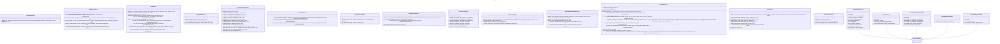

```mermaid
---
title: services
---
classDiagram
    class AROGraphService {
        - __init__(self, aro_service, aro_repository, employee_repository, team_repository, workstation_repository, event_publisher) None
        - __getattr__(self, name)
    }

    class ARORosterService {
        - __init__(self, aro_assignment_repository, team_repository) None
        + handle_aro_assignments(self, employees, team_id, start_date, prefetched_data) List[Employee]
        + process_full_day_aro_assignments(self, team_id, available_employees, prefetched_data, processed_employees) None
        + process_period_specific_aro_assignments(self, team_id, available_employees, prefetched_data, processed_employees) None
        + add_aro_employees(self, aro_ids, available_employees, prefetched_data, processed_employees) None
        + handle_understaffed_teams(self, available_by_team_and_period, teams, period, prefetched_data) Set[int]
    }

    class AROService {
        - __init__(self, aro_repository, employee_repository, team_repository, team_aro_repository, event_publisher) None
        + register_event_handler(self, event_type, handler) None
        - _trigger_event(self, event_type, event) None
        + assign_aro(self, employee_id, to_team_id, assignment_date, period) Dict[str, str]
        + find_aro_assignment(self, employee_id, assignment_date, period) Optional[AROAssignment]
        + remove_aro_assignment(self, assignment_id) Dict[str, str]
        + get_aro_for_workstations(self, team_id, period, assignment_date, empty_workstations) Optional[AROAssignment]
        + get_aro(self, team_id, period, assignment_date, empty_workstations) Optional[AROAssignment]
        + get_workstation_aro_mapping(self, team_id, period, assignment_date, empty_workstations) Dict[int, List[int]]
        + get_employees_for_team_and_period(self, team_id, assignment_date, period) List[Employee]
    }

    class AssignmentService {
        - __init__(self, employee_repository, rule_registry) None
        + can_assign(self, employee, station, assign_date, period) bool
        + create_assignment(self, employee, station, assign_date, period)
    }

    class CacheInvalidationHandler {
        - __init__(self, aro_graph_service) None
        + handle_aro_assignment_created(self, event) None
        + handle_aro_assignment_removed(self, event) None
        + handle_aro_assignment_updated(self, event) None
        + handle_team_member_added(self, event) None
        + handle_team_member_removed(self, event) None
        + handle_workstation_added_to_team(self, event) None
        + handle_workstation_removed_from_team(self, event) None
        + handle_qualification_added(self, event) None
        + handle_qualification_removed(self, event) None
        - _invalidate_graph_cache_for_date(self, assignment_date, period) None
        - _invalidate_edge_cost_cache_for_teams(self, from_team_id, to_team_id) None
        - _invalidate_graph_cache_for_team(self, team_id) None
        - _invalidate_all_graph_caches(self) None
    }

    class CPModelBuilder {
        + build_model(self, employees, workstations, period, team_id, aro_data, start_date, team_name, employee_history_repo) Tuple[cp_model.CpModel, Dict]
        + solve_model(self, model, assign, employees, workstations, period, start_date) List[WorkAssignment]
        + solve_one_period(self, employees, workstations, period, team_id, start_date, aro_data, team_name, employee_history_repo) List[WorkAssignment]
    }

    class RegressionTestResult {
        - __init__(self, scenario_name, passed, metrics_results, error_message) None
        - __str__(self) str
        + get_failed_metrics(self) Dict[str, Tuple[Any, Any]]
    }

    class RegressionTestService {
        - __init__(self, employee_repository, workstation_repository, team_repository, schedule_service, schedule_repository, session) None
        + run_regression_tests(self, scenarios) List[RegressionTestResult]
        + load_regression_tests_from_file(self, file_path, team_name, start_date) List[RegressionTestScenario]
        + save_golden_outputs(self, scenarios, output_file)
    }

    class ScenarioComparator {
        - __init__(self, results) None
        + compare_metrics(self, metric_name) pd.DataFrame
        + compare_employee_workload(self) pd.DataFrame
        + compare_workstation_utilization(self) pd.DataFrame
        + generate_comparison_charts(self, output_dir)
        + generate_comparison_report(self, output_file)
        + generate_scenario_heatmap(self, output_dir)
        + generate_all_analytics(self, output_dir)
    }

    class ScenarioSimulator {
        - __init__(self, employee_repository, workstation_repository, team_repository, schedule_service, schedule_repository, session) None
        + run_scenario(self, scenario) Dict[str, Any]
        + run_scenarios(self, scenarios) Dict[str, Dict[str, Any]]
        - _calculate_metrics(self, assignments, employees, workstations) Dict[str, Any]
    }

    class ScheduleRecalculationHandler {
        - __init__(self, team_repository, employee_repository, workstation_repository, schedule_service) None
        + handle_aro_assignment_created(self, event) None
        + handle_aro_assignment_removed(self, event) None
        + handle_aro_assignment_updated(self, event) None
        - _recalculate_schedules(self, from_team_id, to_team_id, assignment_date) None
        - _recalculate_team_schedule(self, team_id, team_name, assignment_date) None
    }

    class ScheduleService {
        + int DEFAULT_PERIODS_PER_DAY
        + int DEFAULT_SCHEDULE_ID
        - __init__(self, constraints, cp_model_builder, aro_roster_service, team_lookup_service) None
        + assign_employee(self, employee, workstation, period, schedule_id, schedule_repository) WorkAssignment
        - _parse_offline(self, offline) OfflineDict
        - _create_schedule(self, team_id, start_date, periods_per_day, call_ins, offline, offline_dict, force_complete, schedule_repository)
        + generate_schedule(self, employees, workstations, start_date, periods_per_day, team_name, call_ins, offline, force_complete, session, team_repository, aro_assignment_repository, schedule_repository, aro_service, aro_graph_service, prefetched_data, employee_history_repo) WorkAssignments
        + generate_period_schedule(self, team_id, cp_input, employee_history_repo) WorkAssignments
        + generate_period_schedules(self, teams, period, available_by_team_and_period, prefetched_data) List[WorkAssignment]
        + add_constraint(self, constraint)
        - _get_teams_for_generation(self, args, team_repository) List[Any]
        + generate_schedule_flow(self, args, session, employee_repository, workstation_repository, team_repository, assignment_repository, work_history_repository, aro_repository, aro_service, aro_graph_service, schedule_repository) Dict[str, Any]
    }

    class SeedService {
        - __init__(self, seed_data_repository, department_repository, group_repository, team_repository, workstation_repository, employee_repository, role_repository, line_type_repository) None
        + seed_department(self, department_name) Tuple[int, int, int, int]
        + seed_group(self, group_name, department_id) Tuple[int, int, int]
        + seed_team(self, team_name, group_id) Tuple[int, int]
        + seed_workstations(self, workstation_data_list, team_id) int
        + seed_employees(self, employee_data_list, team_id) int
        + assign_workstations_to_employees(self, employee_data_list, team_name) None
        + seed_all(self) Dict[str, int]
    }

    class TeamLookupService {
        - __init__(self, team_repository) None
        + get_team_id(self, team_name, prefetched_data) int
        + get_team_name(self, team_id, prefetched_data) str
    }

    class TestAROGraphService {
        + setUp(self)
        + test_build_aro_transfer_graph(self)
        + test_find_optimal_aro_paths(self)
        + test_assign_optimal_aros(self)
        + test_multi_hop_path(self)
        + test_caching(self)
        + test_k_shortest_paths(self)
        + test_enhanced_edge_cost(self)
        + test_transaction_retry(self)
        + test_transaction_max_retries(self)
    }

    class TestAROService {
        + setUp(self)
        + test_assign_aro(self)
        + test_assign_aro_already_assigned(self)
        + test_get_employees_for_team_and_period(self)
    }

    class TestCacheInvalidationHandler {
        + setUp(self)
        + test_handle_aro_assignment_created(self)
        + test_handle_aro_assignment_removed(self)
        + test_handle_aro_assignment_updated(self)
        + test_handle_team_member_added(self)
        + test_handle_qualification_added(self)
    }

    class TestRealWorldScheduling {
        + test_generate_schedule_real_world(self)
    }

    class TestSingleDayScheduling {
        + setUp(self)
        - _create_test_data(self)
        + test_generate_schedule_single_day(self)
    }

    TestAROGraphService --|> `unittest.TestCase`

    TestAROService --|> `unittest.TestCase`

    TestCacheInvalidationHandler --|> `unittest.TestCase`

    TestRealWorldScheduling --|> `unittest.TestCase`

    TestSingleDayScheduling --|> `unittest.TestCase`
```
