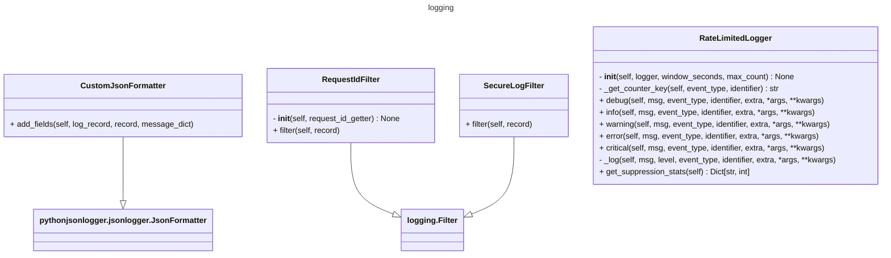

```mermaid
---
title: logging
---
classDiagram
    class CustomJsonFormatter {
        + add_fields(self, log_record, record, message_dict)
    }

    class RequestIdFilter {
        - __init__(self, request_id_getter) None
        + filter(self, record)
    }

    class SecureLogFilter {
        + filter(self, record)
    }

    class RateLimitedLogger {
        - __init__(self, logger, window_seconds, max_count) None
        - _get_counter_key(self, event_type, identifier) str
        + debug(self, msg, event_type, identifier, extra, *args, **kwargs)
        + info(self, msg, event_type, identifier, extra, *args, **kwargs)
        + warning(self, msg, event_type, identifier, extra, *args, **kwargs)
        + error(self, msg, event_type, identifier, extra, *args, **kwargs)
        + critical(self, msg, event_type, identifier, extra, *args, **kwargs)
        - _log(self, msg, level, event_type, identifier, extra, *args, **kwargs)
        + get_suppression_stats(self) Dict[str, int]
    }

    CustomJsonFormatter --|> `pythonjsonlogger.jsonlogger.JsonFormatter`

    RequestIdFilter --|> `logging.Filter`

    SecureLogFilter --|> `logging.Filter`
```
