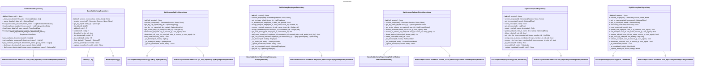

```mermaid
---
title: repositories
---
classDiagram
    class FileSeedDataRepository {
        - __init__(self, base_path) None
        - _load_json_file(self, file_path) Optional[Dict[str, Any]]
        - _parse_date(self, date_str) Optional[date]
        + load_workstation_data(self, team_name) List[WorkstationSeedData]
        + load_employee_data(self, team_name) List[EmployeeSeedData]
        + load_team_data(self, team_name) TeamSeedData
        + load_group_data(self, group_name) GroupSeedData
        + load_department_data(self, department_name) DepartmentSeedData
        + get_available_departments(self) List[str]
        + get_available_groups(self, department_name) List[str]
        + get_available_teams(self, department_name, group_name) List[str]
        - _find_team_directory(self, team_name) Optional[str]
        - _find_group_directory(self, group_name, department_name) Optional[str]
    }

    class BaseSqlAlchemyRepository {
        - __init__(self, session, model_class, entity_class) None
        + session_scope(self) Generator[Session, None, None]
        + get_by_id(self, entity_id) Optional[T]
        + list_all(self) List[T]
        + add(self, entity) T
        + update(self, entity) T
        + delete(self, entity_id) bool
        - _to_domain(self, model) T
        - _to_model(self, entity) M
        - _find_first(self, **kwargs) Optional[T]
        - _stamp_updated(self, model) None
        - _update_model(self, model, entity) None
    }

    class SqlAlchemyApiKeyRepository {
        - __init__(self, session) None
        + session_scope(self) Generator[Session, None, None]
        + get_by_key_id(self, key_id) Optional[ApiKey]
        + get_by_key_value(self, key_value) Optional[ApiKey]
        + get_active_keys_for_user(self, user_id) List[ApiKey]
        + deactivate_key(self, key_id, source_ip, user_agent) bool
        + deactivate_all_keys_for_user(self, user_id, source_ip, user_agent) int
        + key_exists(self, key_value) bool
        - _to_domain(self, model) ApiKey
        - _to_model(self, entity) ApiKeyModel
        - _update_model(self, model, entity) None
    }

    class SqlAlchemyEmployeeRepository {
        - __init__(self, session) None
        + session_scope(self) Generator[Session, None, None]
        + get_by_team_id(self, team_id) List[Employee]
        + is_available(self, employee_id, date_obj, period) bool
        + assign_role(self, employee_id, role_name, team_id) Dict[str, str]
        + remove_role(self, employee_id, role_name, team_id) Dict[str, str]
        + assign_workstation(self, employee_id, workstation_id) Dict[str, str]
        + get_work_history(self, employee_id, workstation_id) list
        + add_work_history(self, employee_id, workstation_id, worked_date, work_period, end_flag) bool
        + get_last_worked_date(self, employee_id, workstation_id) Tuple[Optional[date], Optional[int]]
        - _to_domain(self, model) Employee
        - _to_model(self, entity) EmployeeModel
        - _update_model(self, model, entity) None
        + get_by_name(self, name) Optional[Employee]
        + get(self, id) Optional[Employee]
    }

    class SqlAlchemyRefreshTokenRepository {
        - __init__(self, session) None
        + session_scope(self) Generator[Session, None, None]
        + get_by_token_id(self, token_id) Optional[RefreshToken]
        + get_active_tokens_for_user(self, user_id) List[RefreshToken]
        + revoke_token(self, token_id, source_ip, user_agent) bool
        + revoke_all_tokens_for_user(self, user_id, source_ip, user_agent) int
        + delete_expired_tokens(self, before_date) int
        + token_exists(self, token_id) bool
        - _to_domain(self, model) RefreshToken
        - _to_model(self, entity) RefreshTokenModel
        - _update_model(self, model, entity) None
    }

    class SqlAlchemyRoleRepository {
        - __init__(self, session) None
        + session_scope(self) Generator[Session, None, None]
        + get_by_name(self, name) Optional[Role]
        + name_exists(self, name) bool
        + get_all_roles(self) List[Role]
        + create_role(self, name, description) Role
        + update_role(self, role_id, name, description) Optional[Role]
        + delete_role(self, role_id) bool
        + get_roles_for_team_member(self, team_member_id) List[Role]
        + assign_role_to_team_member(self, team_member_id, role_id) bool
        + remove_role_from_team_member(self, team_member_id, role_id) bool
        - _to_domain(self, model) Role
        - _to_model(self, entity) RoleModel
        - _update_model(self, model, entity) None
    }

    class SqlAlchemyUserRepository {
        - __init__(self, session) None
        + session_scope(self) Generator[Session, None, None]
        + get_by_username(self, username) Optional[User]
        + get_by_email(self, email) Optional[User]
        + username_exists(self, username) bool
        + email_exists(self, email) bool
        + update_last_login(self, user_id, ip_address, user_agent) bool
        + add_role(self, user_id, role_name, source_ip, user_agent) bool
        + remove_role(self, user_id, role_name, source_ip, user_agent) bool
        + get_users_by_role(self, role_name) List[User]
        + activate_user(self, user_id, source_ip, user_agent) bool
        + deactivate_user(self, user_id, source_ip, user_agent) bool
        - _to_domain(self, model) User
        - _to_model(self, entity) UserModel
        - _update_model(self, model, entity) None
    }

    FileSeedDataRepository --|> `domain.repositories.interfaces.seed_data_repository.SeedDataRepositoryInterface`

    BaseSqlAlchemyRepository --|> `Generic[T, M]`

    BaseSqlAlchemyRepository --|> `BaseRepository[T]`

    SqlAlchemyApiKeyRepository --|> `BaseSqlAlchemyRepository[ApiKey, ApiKeyModel]`

    SqlAlchemyApiKeyRepository --|> `domain.repositories.interfaces.api_key_repository.ApiKeyRepositoryInterface`

    SqlAlchemyEmployeeRepository --|> `BaseSqlAlchemyRepository[Employee, EmployeeModel]`

    SqlAlchemyEmployeeRepository --|> `domain.repositories.interfaces.employee_repository.EmployeeRepositoryInterface`

    SqlAlchemyRefreshTokenRepository --|> `BaseSqlAlchemyRepository[RefreshToken, RefreshTokenModel]`

    SqlAlchemyRefreshTokenRepository --|> `domain.repositories.interfaces.refresh_token_repository.RefreshTokenRepositoryInterface`

    SqlAlchemyRoleRepository --|> `BaseSqlAlchemyRepository[Role, RoleModel]`

    SqlAlchemyRoleRepository --|> `domain.repositories.interfaces.role_repository.RoleRepositoryInterface`

    SqlAlchemyUserRepository --|> `BaseSqlAlchemyRepository[User, UserModel]`

    SqlAlchemyUserRepository --|> `domain.repositories.interfaces.user_repository.UserRepositoryInterface`
```
